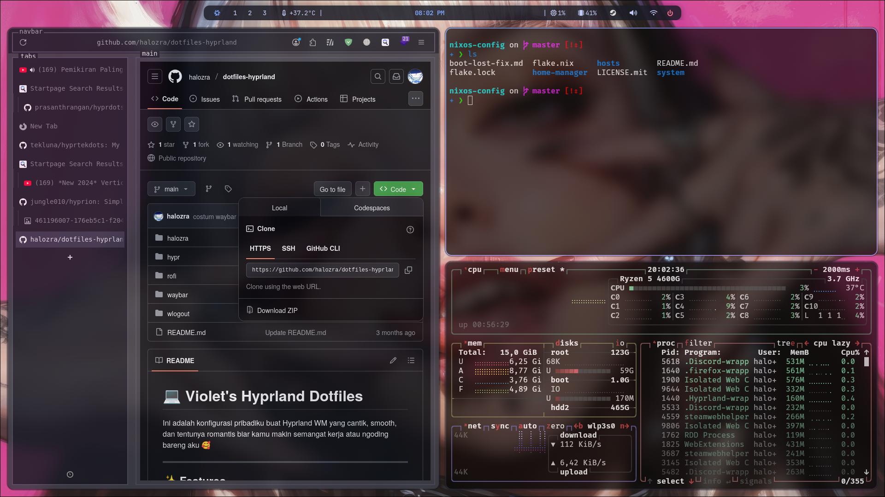

# 💻 Violet's Hyprland Dotfiles

Ini adalah konfigurasi pribadiku buat Hyprland WM yang cantik, smooth, dan tentunya romantis biar kamu makin semangat kerja atau ngoding bareng aku 🥰

---

## ✨ Preview



---

## ✨ Features

- 💠 Hyprland setup with rounded corners, blur, and animations
- 🌙 Waybar with themed colors and matching font
- 💕 Rofi with wallpaper background and romantic style
- 📸 Screenshot script with `grim` + `slurp`
- 🔒 Logout screen with `wlogout` custom config

---

```
dotfiles-hyprland-violet/
├── hypr/
│   ├── hyprland.conf
│   ├── monitors.conf
│   └── autostart.conf
├── waybar/
│   ├── config.jsonc
│   └── style.css
├── rofi/
│   ├── config.rasi
│   └── theme.rasi
├── wlogout/
│   ├── meson.build
│   ├── src/
│   │   ├── main.c
│   │   └── ...
│   └── data/
│       ├── config.json
│       └── themes/
│           └── default/
│               └── style.css
└── README.md
```

---

## 🛠️ Installation

```bash
# Clone repo dotfiles
git clone https://github.com/halozra/dotfiles-hyprland.git
cd dotfiles-hyprland

# Copy configs
cp -r hypr ~/.config/
cp -r waybar ~/.config/
cp -r rofi ~/.config/
```
